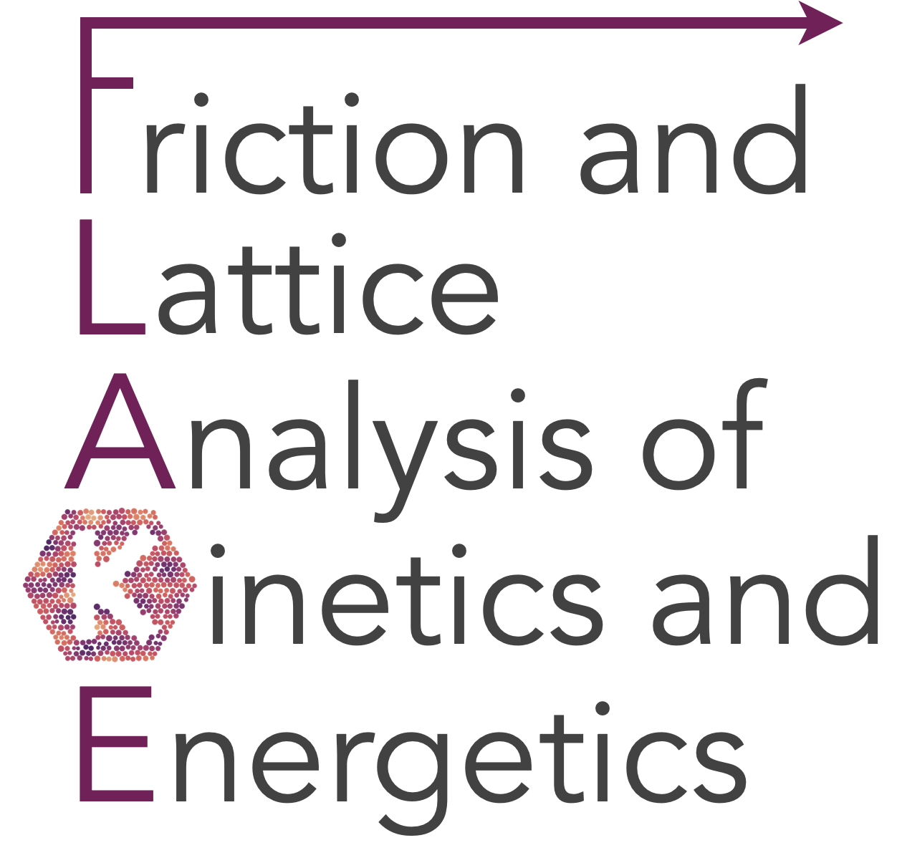

.. FLAKE documentation master file

FLAKE - rigid cluster friction simulator
=========================================

Compute the interlocking potential between a periodic substrate and a finite-size adsorbate, in the rigid approximation.
The adsorbate is treated as a rigid body with a given orientation :math:`\theta` and center of mass (CM) position :math:`x_\mathrm{cm}, y_\mathrm{cm}`.
This model mimics the basic physics of 2D material flakes sliding over a substrate in AFM experiments (e.g. graphene on graphite, noble gas islands on metal surfaces) and colloidal particles under external drivers.

The rigid approximation allows treatment of large clusters approaching sizes of AFM experiments — a reasonable approximation for stiff materials like graphite and hBN.
The large-scale capabilities and qualitative description make FLAKE the perfect tool to explore interfaces at little computational cost and derive scaling laws as a function of system parameters (cluster size, substrate potential, orientation).

FLAKE is not object oriented but mainly function-based, keeping the software simple, easy to extend, and allowing individual components to be integrated in other projects.

The two main modules are ``flake.substrate`` and ``flake.cluster``.
``flake.substrate`` creates rigid substrates of different symmetry and Fourier complexity.
``flake.cluster`` provides functions to create finite clusters of different shapes.
``flake.maps`` combines substrate and cluster to compute static energy landscapes.
``flake.dynamics`` and ``flake.sweep`` run and parallelise overdamped Langevin MD.
``flake.string_method`` finds minimum energy paths and energy barriers.

This software was developed at SISSA, Trieste, Italy in the group of Prof. Erio Tosatti and Andrea Vanossi,
based on experiments by Xin Cao and Clemens Bechinger at the University of Konstanz, Germany.
For questions or support contact `Andrea Silva <ansilva@sissa.it>`_.

.. toctree::
   :maxdepth: 3

   intro
   installation
   examples
   modules

Indices and tables
==================

* :ref:`genindex`
* :ref:`modindex`
